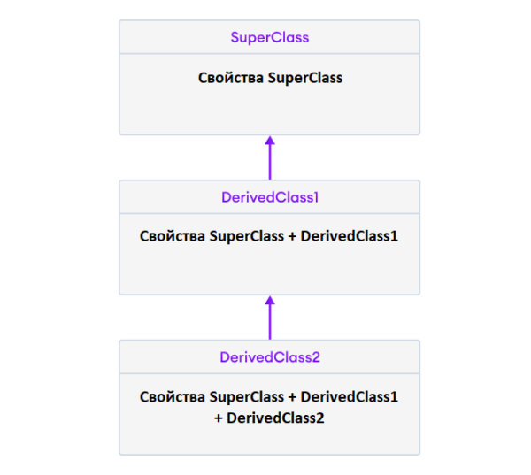

## Подкласс и суперкласс в Python

```
# Определяем суперкласс
class super_class:
    # Атрибуты и методы суперкласса
    

# Наследование
class sub_class(super_class):
    # Атрибуты и метод super_class
    # Атрибуты и метод sub_class
```

```python
# Классы, которые будем использовать, как родительские: Pet и Animal
class Pet:
    def sleep(self):
        print(f"I'll sllep.")
    
class Animal:
    # Атрибут и метод родительского класса
    name = ""
    def feed(self, meat):
        print(f"I'll eat all {meat} kilos! ")
        
# Множественное наследование. 
# Наследуем от класса Animal и класса Pet - пишем родительский класс в скобках
class Dog(Animal, Pet):
    # унаследован метод feed()
    # Новый метод в дочернем классе
    def display(self):
        # Доступ к атрибуту name родительского класса Animal с помощью self.name
        print("My name is ", self.name)
        
    # Переопределяем метод sleep() родительского класса Pet   
    def sleep(self):
        # можем получить доступ к методу супер класса Pet
        super().sleep()
        # 
        print(f"I don't like sleeping!")
 
# Создаем объект дочернего класса
labrador = Dog()
# Получаем доступ к атрибуту и методу родительского класса
labrador.name = "Rohu"
# Вызываем унаследованный метод
labrador.feed(3)
# Вызываем метод своего класса
labrador.display()

# Если атрибут не найден в самом классе, поиск начинается в родительском классе. 
# Это повторяется рекурсивно, если родительский класс сам наследуется от других классов.
```

### Отношения в наследовании

В Python наследование — это отношения типа is-a (является).  
То есть, мы используем наследование только в том случае, если между двумя классами существует связь типа «является».

**Кошка** является **Животным**

### Переопределение методов в наследовании

```python
class Animal:
    # Атрибуты и метод суперкласса
    name = ""
    def eat(self):
        print("I can eat")
 
# Наследуем от класса Animal
class Dog(Animal):
    # Переопределяем метод eat()
    def eat(self):
        print("I like to eat bones")
 
# Создаем объект подкласса
labrador = Dog()
 
# Вызываем метод eat() через объект класса Dog
labrador.eat()
```

### Многоуровневое наследование в Python

В Python дочерний класс может наследовать не только родительский класс, но и другой дочерний класс. 



```
class SuperClass:
    # Код родительского класса
 
class ПроизводныйКласс1(SuperClass):
    # Код дочернего класса 1
 
class ПроизводныйКласс2(ПроизводныйКласс1):
    # Код дочернего класса 2
```

```python
class SuperClass:
    def super_method(self):
        print("Super Class method called")
 
# Определяем класс, который наследует SuperClass
class DerivedClass1(SuperClass):
    def derived1_method(self):
        print("Derived class 1 method called")
 
# Определяем класс, который наследует DerivedClass1
class DerivedClass2(DerivedClass1):
    def derived2_method(self):
        print("Derived class 2 method called")
 
# Создаем объект класса DerivedClass2
d2 = DerivedClass2()
 
# Вызываем методы
d2.super_method()  
d2.derived1_method()  
d2.derived2_method()
```

### Порядок вызова методов (MRO) в Python

Если два родительских класса имеют одинаковое имя метода 
и дочерний класс (который наследует оба родительских класса) вызывает этот метод, 
Python использует MRO (**порядок вызова методов**) для вызова нужного метода. 

В нашем примере методы должны наследоваться сначала от самого левого родительского класса:

```python
class SuperClass1:
    def info(self):
        print("Super Class 1 method called")
 
class SuperClass2:
    def info(self):
        print("Super Class 2 method called")
 
class Derived(SuperClass1, SuperClass2):
    pass
 
d1 = Derived()
d1.info() 
```


