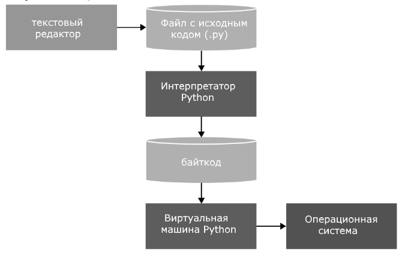

[< содержание](content.md)  
[написание программ >](writing_programs.md)

## Python
Python (читаеться ПАЙТОН )представляет популярный высокоуровневый язык программирования, 
который предназначен для создания приложений различных типов.

Основное применение - **аналитика** данных, в том числе работа с искусственным интеллектом, с использованием
соответствующих пакетов.

Представлен в 1991 году голландским разработчиком Гвидо Ван Россумом.

Версии: 
- 2000 год - версия 2.0, 
- 2008 год - версия 3.0,
- октябрь 2024 года - версия 3.13

### Особенности

- Код программ имеет вид скрипта.
- Необходим интерпретатор, который запускает и выполняет скрипт.
- Поддерживаются различные парадигмы программирования, в том числе объектно-ориентированное и функциональное.
- Портативность и платформо-независимость. (Windows, Mac OS, Linux)
- Автоматическое управление памяти
- Динамическая типизация

В интерпретаторе объединены: 
  - трансляция исходного кода в байткод,
  - перевод виртуальной машиной байткода в набор машинных команд

### Популярные пакеты библиотеки

- Для создания графических приложений:
  - Tkinter
  - PyQt/PySide
  - wxPython
  - DearPyGui
  - EasyGUI

  
- Для создания мобильных приложений:
  - Kivy
  - Toga
  

- Для создания веб-приложений:
  - Django
  - Flask
  - FastAPI
  - Pylons
  - Bottle
  - CherryPy
  - TurboGears
  - Nagare

- Для автоматизации процессов:
  - Selenium (для тестирования веб-приложений)
  - Flask
  - FastAPI
  - Pylons
  - Bottle
  - CherryPy
  - TurboGears
  - Nagare
  - robotframework
  - pywinauto
  - Lettuce
  - Behave
  - Requests
   

- Для работы с файлами:
  - OpenPyXL (Excel
  - lxml (XML)
  - ReportLab/borb (PDF)
  - pdfrw/PyPDF2 (PDF)
  - Pandas (CSV и Excel)

- Для машинного обучения, искусственного интеллекта, Data Science:
  - Pandas
  - SciPy
  - PyTorch
  - Matplotlib
  - Theano
  - Tensorflow
  - OpenCV
  - Scikit-Learn
  - Keras
  - NumPy

- Для визуализации:
  - Matplotlib
  - Seaborn
  - Plotly
  - Bokeh
  - Altair
  - HoloViews
