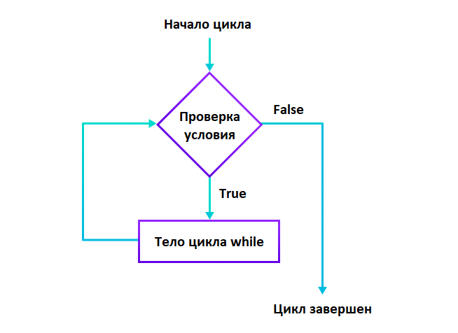

## Цикл while

Цикл while используется для выполнения блока кода до тех пор, пока не будет достигнуто определенное условие.
Алгоритм действий:
   - Сначала цикл while обрабатывает условие.
   - Если условие вычисляется как True, то выполняется код внутри цикла while.
   - Затем условие повторно обрабатывается. Этот процесс продолжается до тех пор, пока условие не станет False.
   - Если условие вычисляется как False, цикл завершает свое выполнение.



```python
# В этой программе мы выводим числа от 1 до 5
 
# Инициализация переменных
i = 1
n = 5
 
# Цикл while с i = 1 до 5
while i <= n:
    print(i)
    i = i + 1
# --------------------------------------------------------
# В этой программе мы вычисляем сумму чисел до тех пор,
# пока пользователь не введет 0
 
total = 0
 
number = int(input('Enter a number: '))
 
# Складываем числа, пока number не будет равен 0
while number != 0:
    total += number    # total = total + number
    
    # Запрашиваем пользовательский ввод
    number = int(input('Enter a number: '))
    
print('total =', total)
# --------------------------------------------------------
# Бесконечный цикл
age = 32
# Условие для проверки всегда равно True
while age > 18:
    print('You can vote')
# --------------------------------------------------------
#  Цикл while может иметь необязательный блок else, 
#  который будет выполняться после того, как условие цикла станет False.
# Блок else не будет выполняться, если цикл while остановлен оператором break
counter = 0
 
while counter < 3:
    print('Inside loop')
    counter = counter + 1
else:
    print('Inside else')

counter = 0

# Цикл завершает свое выполнение из-за оператора break. # Блок else не выполняется 
while counter < 3:
    if counter == 1:
        break
 
    print('Inside loop')
    counter = counter + 1
else:
    print('Inside else')


```

Цикл for обычно используется, когда известно количество итераций.  
Цикл while обычно используется, когда количество итераций неизвестно.

```python
# Этот цикл повторяется 4 раза (от 0 до 3)
for i in range(4):
    print(i)
    
i = 0    
while i<10:
    i += 0.1
```

